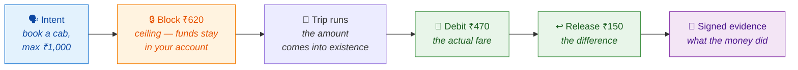
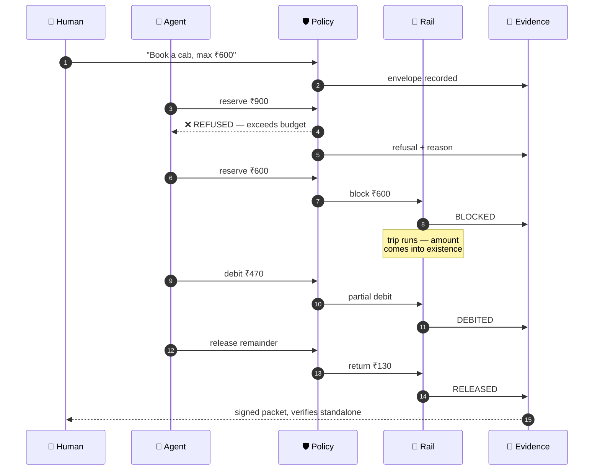

<div align="center">

# Amanat

**अमानत** — *a thing held in trust, to be returned to its owner*

### Amount-contingent settlement for agent-initiated payments

*Block a ceiling. Debit the actual. Prove what the money did.*

[](#testing)
[](#quick-start)
[](#what-it-does)
[](#the-evidence-table)
[](#testing)

### ▶ Try it live

**[Interactive demo](https://amanat-demo-699979063196.asia-south1.run.app)** — set a budget, run a settlement or attack it, watch the policy engine refuse and the signed chain verify itself — then load the signed receipt from a **real Cashfree pre-auth run** and verify *that* in your browser too.
&nbsp;·&nbsp;
**[Verify a signed packet](docs/sample/dispute-packet.html)** — one self-contained file: open it from a clone and it recomputes its own hashes and signatures in your browser, offline; press *Tamper* to watch it catch a change ([hosted copy](https://claude.ai/code/artifact/6edf0c30-6be8-4f60-961b-285b11af9995)).
&nbsp;·&nbsp;
**Watch the debit leg run against a real rail's sandbox** — `python -m amanat.rails.probe_cashfree` holds ₹620 and captures ₹470 on Cashfree's UPI pre-auth sandbox (`HTTP 200`). Whether the ₹150 comes back at capture or at the documented 7-day expiry is [being measured](docs/observations/cashfree-release/).
&nbsp;·&nbsp;
**[Pitch deck (PDF)](docs/pitch/amanat-deck.pdf)** — the five-minute argument (`docs/pitch/amanat-deck.pptx` for editing).
&nbsp;·&nbsp;
**Work at a rail in the registry?** [Your rows, and how to correct one](#if-you-work-at-a-rail-in-the-registry).

</div>

---

<table>
<tr><td width="140"><b>Builder</b></td><td>Eeshan Singh Pokharia</td></tr>
<tr><td><b>Email</b></td><td><a href="mailto:eeshan.singh53@gmail.com">eeshan.singh53@gmail.com</a></td></tr>
</table>

> **The bar this project holds itself to:** *every money action explainable, bounded and
> gated; show the audit trail and one failure handled gracefully.*
>
> This is a governance and auditability project. It is deliberately modest in scope, and
> the section it is proudest of is [What building it found](#what-building-it-found) —
> which is entirely negative results.

---

## The problem

A human in a cab **watches the meter and pays what it says.** They never commit to a
number in advance.

An AI agent cannot do that. To spend on your behalf it has to commit to an amount
**before that amount exists** — before the meter has run, before the grocery
substitutions are known, before the charger reports kWh.

So it must choose a ceiling, and both directions of error cost real money:

<div align="center">

| Ceiling too **low** | Ceiling too **high** |
|:---:|:---:|
| debit declined → **sale lost** | customer's money **locked up for nothing** |

</div>

Everything here exists to make that choice safely, and to prove afterwards what actually
happened.

---

## What it does

Instead of prepaying or paying afterwards, the agent blocks a ceiling in **your own bank
account**, draws only the real amount, and returns the difference.



This runs on **UPI Single Block Multiple Debit** (NPCI's SBMD, branded *Reserve Pay*):
the ₹620 never leaves your account — blocked there, visible in your own UPI app,
revocable by you at any moment. That the rail *legally* permits a debit smaller than the
block is settled from the NPCI circular itself (OC-228, `PRIMARY` evidence), not from a
vendor's blog.

**And the debit leg runs.** On Cashfree's UPI pre-authorization *sandbox*, a ₹620 hold was
captured for ₹470 — `HTTP 200`, `captured_amount 470.0`, `PRE_AUTH|Transaction Success`.
Razorpay's Capture API refuses the same partial capture (its own documented error; a test-mode capture returned it once, by hand). (The authorisation was forced with the
sandbox's `POST /simulate`, so this measures Cashfree's API, not an issuer.) What was **not**
observed is the ₹150 going back: the API's own read of the order shows `payment_amount 620.0`
and no refund, and Cashfree documents release only for an authorisation *not captured* within
seven days. That leg is recorded as `UNVERIFIED` and is being measured — see
[`docs/observations/`](docs/observations/cashfree-release/). Reproduce the capture in ~15
seconds: `python -m amanat.rails.probe_cashfree`.

### The same intent across three real rails

Each row says what it rests on. The same amount-contingent settlement, asked of three real rails:

| Rail | Debit smaller than the block? | Evidence |
|---|---|---|
| **UPI SBMD** (Reserve Pay) | ✅ legal by the circular | `PRIMARY` — NPCI OC-228, read from the scanned PDF |
| **Cashfree** UPI pre-auth | ✅ **capture accepted in the sandbox** — ₹470 of ₹620; the remainder's release *not observed* | `OBSERVED` — `HTTP 200`, measured 29 Aug 2026 |
| **Razorpay** manual capture | ❌ refused | `SECONDARY` — its own documented error, *"Capture amount must be equal to the amount authorized"* (also returned by a test-mode capture, by hand; the exchange was not stored) |

The negative and the positive are both the point: Razorpay forecloses the mechanism and
Cashfree's sandbox accepts the debit leg. What happens to the remainder differs by rail —
SBMD keeps it blocked until someone revokes it (`PRIMARY`), while Cashfree documents a
seven-day expiry and is silent on a partial capture's remainder (`UNVERIFIED`) — and the
signed chain records which path actually ran. Compare two chains side by side:
`python -m amanat.compare`.

---

## Quick start

No credentials needed for the core. That is a design property, not an oversight.

```bash
git clone https://github.com/HERPESME/amanat && cd amanat

# The eight-act walkthrough — the whole argument in one command
uv run --with cryptography python -m amanat.demo

# 1524 tests. No API key, no network (Node.js runs the browser-verifier tests).
uv run --with pytest --with cryptography --with httpx --with fastapi --with pydantic \
       --with numpy --with scikit-learn --with pandas --with pyarrow --with hypothesis pytest tests/ -q
```

```bash
# Same intent, two rails, two signed chains — side by side
uv run --with cryptography python -m amanat.compare

# A dispute packet that verifies itself in your browser (open the file it writes)
uv run --with cryptography python -m amanat.evidence.render

# Settle against a real AP2 mandate, then dispute it three ways
uv run --with cryptography python -m amanat.dispute.demo
```

> **Hosted:** the same demo runs at
> **<https://amanat-demo-699979063196.asia-south1.run.app>** (Cloud Run, scales to zero).

<details>
<summary><b>Optional — live agent, the ML frontier, real-rail settlement</b></summary>

```bash
cp .env.example .env        # add GEMINI_API_KEY or ANTHROPIC_API_KEY

# Which credentials are present, and does each actually work?
uv run --with google-genai --with httpx --with cryptography python -m amanat.doctor

# The LLM agent against a governed session
uv run --with google-genai --with cryptography python -m amanat.orchestrator.cli

# Ceiling frontier on real NYC TLC fares (downloads ~100MB once)
uv run --with numpy --with pandas --with scikit-learn --with pyarrow \
       python -m amanat.ceiling.frontier

# Cashfree sandbox: hold ₹620, capture ₹470 (HTTP 200); the ₹150's return is not observed
uv run --with httpx --with cryptography python -m amanat.rails.probe_cashfree

# Cashfree sandbox: lose the reply to a reservation, a capture and a release (and restart a session); each retry must act once
uv run --with httpx --with cryptography python -m amanat.rails.probe_cashfree_retry

# Reproduce Razorpay's refusal in test mode (HTTP 400; needs a browser Checkout to reach `authorized`)
uv run --with httpx --with cryptography python -m amanat.rails.probe

# Settle a real Razorpay test-mode payment (capture then refund, real ids)
uv run --with httpx --with cryptography python -m amanat.rails.authorize
uv run --with httpx --with cryptography python -m amanat.rails.settle \
       --payment pay_XXXX --actual 47000
```

Docker:

```bash
docker compose run --rm demo      # walkthrough
docker compose run --rm tests     # containment suite
docker compose run --rm frontier  # ceiling frontier
```

</details>

---

## Architecture

The one sentence that carries the design:

<div align="center">

### The LLM proposes. The policy engine disposes. The rail enforces.

*Three layers of authority, each stricter than the last — and the outermost one is a bank.*

</div>

<div align="center">
  
</div>

If the model is prompt-injected, compromised, or simply wrong, the worst it can produce
is a **refusal record** — never a payment. That property is proven without a model in
`tests/test_session.py::test_a_refused_proposal_never_reaches_the_rail`, and stress-tested
by 23 adversarial tests.

📐 Full C4 diagrams: [`docs/architecture/`](docs/architecture/) ·
📋 Generated rail semantics: [`docs/RAIL_SEMANTICS.md`](docs/RAIL_SEMANTICS.md) ·
🗂️ The same table as versioned JSON with a schema: [`docs/registry/`](docs/registry/)

---

## One transaction, end to end



Step 3 is the interesting one. The model asked for a statistically sensible ceiling and
the policy engine said no, because **your budget is a harder boundary than the model's
confidence** — and the refusal is signed into the chain, so the artifact later shows not
only what happened but what was prevented.

---

## The two ideas worth explaining

### 1 · Every capability is cited, or it is refused

The code cannot say *"this rail supports X"* without a verbatim quote from the source.
There is no third state.

```python
Capability(
    name="partial_debit", supported=True,
    source_tier=SourceTier.PRIMARY,
    citation="NPCI/UPI/OC-228/2025-26",
    quote="The current block limits (unutilised) are always checked "
          "before initiating a debit...",
)
```

**Absence of evidence is not permission.** An `UNVERIFIED` capability says neither yes nor no
(`supported` is `None`, and the export says `null`), and `permits()` returns `False` for it. This
is why the system spent a day
**refusing its own core mechanism** — partial debit was described only in vendor docs
until the NPCI circular was actually read.

| Tier | Meaning | Usable as fact? |
|---|---|---|
| `PRIMARY` | the rail's own governing text: an NPCI circular, an RBI directive, a network's rules, an open protocol's specification at a pinned revision | ✅ |
| `OBSERVED` | measured against the live API — the quote *is* its response | ✅ |
| `SECONDARY` | PSP docs, for that PSP's own behaviour | ✅ |
| `MARKETING` | blog posts, comparison tables | ❌ |
| `UNVERIFIED` | not established: neither yes nor no | ❌ |

### 2 · The evidence chain goes below authorization

Agent-payment specifications establish what an agent may spend and attest a payment's
outcome: AP2's mandates and receipts, ACP's checkout state, x402's payment receipts. In the
ones read for this project, none records the rail's *intermediate* states — a hold placed, a
partial debit, a release — or the transitions the system **refused** to make. This chain does,
so the artifact shows not only what was authorized but what the money actually did.
(Visa's Trusted Agent Protocol, Mastercard's agentic tokens and Pine Labs' Grantex were not
reviewed and are not characterised here.)

That is an auditability contribution, not a payments one. It is modest, and saying so is
what makes it credible. The primitive is ordinary — hash-linked, signed entries — and generic
tamper-evident logging is well covered elsewhere (SCITT, Sigstore's transparency logs,
receiver-signed receipts). What is offered here is *what* is chained, and refusals with it.

#### What verification proves — and what it does not

| A packet verified on its own proves | It does **not** prove |
|---|---|
| entries hash-link, in order, without gaps | who holds the signing key — the packet embeds it, so anyone can mint one |
| each entry was signed by the key the packet names | that nothing was removed from the end |
| the payloads are unaltered since signing | that the operator did not rewrite history and re-sign it |

Two things the verifier already holds close those gaps: the signer's **public key**
(`trusted_keys`) and a **checkpoint** of the chain taken earlier (`checkpoint`: length and head
hash), which fails a packet that is shorter than, or diverges from, what was committed. A
checkpoint is only as strong as the party holding it; it must live outside the operator's control
(a counterparty, a witness, a timestamp authority). Anchoring checkpoints with independent
witnesses is planned, not built. So: **a packet is checkable offline by a party who does not
trust the orchestrator when that party holds the key or a checkpoint from a source the
orchestrator does not control — and on its own it proves internal consistency only.** The
verifier page says the same, and accepts `#key=<hex>` or `#len=<n>&head=<hash>` in its URL to pin.

The artifact is real, not rhetorical: `python -m amanat.evidence.render` exports the chain
as a **self-contained HTML file that verifies itself in the browser** — recomputing every
hash with WebCrypto and re-checking every Ed25519 signature against the embedded key, with
no network. Edit any payload and it names the entry that no longer verifies; and it says
plainly what a green result means (see above) rather than calling the packet "verified".

> **▶ Verify one in your browser:** open [`docs/sample/dispute-packet.html`](docs/sample/dispute-packet.html)
> from a clone (GitHub shows an HTML file as source, so download it or open it locally), then press
> **Tamper** and watch it catch the change. A hosted copy:
> [claude.ai/code/artifact/6edf0c30…](https://claude.ai/code/artifact/6edf0c30-6be8-4f60-961b-285b11af9995).

### And the dispute

AP2, ACP and x402 establish what an agent may spend and attest a payment's outcome. In the
specifications read for this project, post-authorisation dispute evidence is either out of
scope or an open request rather than a defined record. The contested question comes after —
a cardholder says *"my agent did it"* — and this project produces a record to settle it
against, so it can adjudicate.

Give it a signed packet, an **AP2 Open Payment Mandate** (read from AP2's own schema,
`vct: mandate.payment.open.1`, field names and constraint types verbatim; the mandate's
signature here is Ed25519 over canonical JSON, not AP2's SD-JWT credential), and a
cardholder's claim. It verifies
the record, then states with cited entry numbers what the evidence shows:

- *"The ₹470 charged was authorized and within every bound — the AP2 mandate at
  entry #0 grants ₹800/txn to citycabs; entry #8 debited ₹470 to citycabs."*
- *"The disputed ₹5,000 was never charged — that attempt was refused at entry #2."*
- *"The signed record cannot establish delivery"* — the honest limit, stated not hidden.

One line governs it, and it's the one to say out loud: **this is an evidence
finding, not an issuer decision.** Whether a dispute is *won* is issuer
discretion; what this establishes is what the record shows. It claims no
win-rate, because a win-rate is not the record's to claim. The output is a
one-click, signed representment packet — authorization + evidence + finding —
that replaces the manual evidence scramble. Run it: `python -m amanat.dispute.demo`,
or press *dispute it* on the [live console](https://amanat-demo-699979063196.asia-south1.run.app).

---

## What building it found

The most useful outputs of this project are its findings — mostly negative, and one
decisive positive one. Each is cited, reproducible, and encoded in the capability table.

<table>
<tr>
<td width="30"><b>1</b></td>
<td><b>NPCI forbids delivery-contingent debit for goods</b><br/>
<i>"the delivery of goods and service should only be after the confirmation of successful
debit"</i> — OC-228. Post-delivery debit is carved out only for variable-amount services.
This killed the original thesis outright and forced the pivot to amount-contingency.</td>
</tr>
<tr>
<td><b>2</b></td>
<td><b>The rail never returns the change by itself</b><br/>
OC-200 keeps funds blocked <i>"till the time mandate is expired, revoked or the mandate
amount is exhausted"</i>. The word "release" appears in neither circular. Of six merchant-side
PSPs whose published API surface was read on 21 Aug 2026, exactly one (Setu) documents a modify
that keeps the mandate; the other five document release as a revoke. Whether Setu's modify may
<i>lower</i> an amount is untested, so that stays <code>UNVERIFIED</code>.</td>
</tr>
<tr>
<td><b>3</b></td>
<td><b>Conformal coverage misses under temporal drift — 18 of 20 configurations</b><br/>
The guarantee is distribution-free but <b>not shift-free</b>. Training on January to
deploy in February breaks exchangeability. Calibrating on recent rather than random rows
narrows the gap ~10× (−3.55pp → +0.91pp) without closing it. A random split would have
shown a clean pass, and would have been a lie about deployment.</td>
</tr>
<tr>
<td><b>4</b></td>
<td><b>Setu's documented API hosts have no address record in public DNS</b><br/>
Credentials are valid and the token endpoint returns 200 — but <code>uatapi.setu.co</code>
and <code>api.setu.co</code> had no address record from Google's or Cloudflare's resolver on
21 Sep 2026 (NXDOMAIN on 21 Aug; the answer changed, and a name that cannot exist now answers the
same way). This measures a resolver, not Setu's API: an allowlist or private DNS is the likeliest
reason, and DNS alone does not show it. Invisible until you hold credentials and try.</td>
</tr>
<tr>
<td><b>5</b></td>
<td><b>Razorpay refuses partial capture — documented, and seen once by hand</b><br/>
<code>HTTP 400 — Capture amount must be equal to the amount authorized</code> is Razorpay's own
documented error, and a test-mode capture returned the same sentence (the exchange was not stored, so
the row rests on the documentation). Reaching that state needed a browser: payment links auto-capture,
and S2S creation is not enabled on a self-serve account.</td>
</tr>
<tr>
<td><b>6</b></td>
<td><b>Cashfree's UPI pre-auth sandbox accepts a partial capture — and the release leg turned out unmeasured</b><br/>
A ₹620 hold, a <code>CAPTURE</code> of ₹470 returning <code>HTTP 200</code> with
<code>captured_amount 470.0</code>: the operation Razorpay's Capture API rejects, and what turns
<code>cashfree_preauth.partial_debit</code> from <code>UNVERIFIED</code> to <code>OBSERVED</code>.
An earlier version of this finding also said the ₹150 remainder was <i>auto-released</i>. That was
inferred, not read: a refused void (which Cashfree documents as impossible after any capture) and
arithmetic. Re-reading the order shows <code>payment_amount 620.0</code> and no refund, so the
release is now <code>UNVERIFIED</code> and a dated measurement is running
(<code>docs/observations/</code>). Enabling pre-auth needed a support ticket (not self-serve).
Reproduce: <code>python -m amanat.rails.probe_cashfree</code>.</td>
</tr>
</table>

---

## The evidence table

107 capabilities across 14 rails. What each claim rests on:

| Rail | Capabilities | Evidence |
|---|---|---|
| **UPI SBMD** (Reserve Pay) | 19 | 14 `PRIMARY` · 4 `SECONDARY` · 1 `UNVERIFIED` |
| **Cashfree** UPI pre-auth | 16 | 12 `OBSERVED` (sandbox, 29 Aug and 20 and 21 Sep 2026) · 3 `SECONDARY` · 1 `UNVERIFIED` — the remainder's release |
| **Razorpay** manual capture | 6 | 6 `SECONDARY` |
| **Setu UMAP** | 3 | 2 `OBSERVED` · 1 `SECONDARY` |
| **UPI OTM** | 2 | 1 `SECONDARY` · 1 `UNVERIFIED` |
| *Reference:* **Visa** card authorization | 10 | 9 `SECONDARY` · 1 `UNVERIFIED` |
| *Reference:* **Stripe** cards, manual capture | 11 | 9 `SECONDARY` · 2 `UNVERIFIED` |
| *Reference:* **Adyen** cards | 9 | 9 `SECONDARY` |
| *Reference:* **x402** protocol extensions | 1 | 1 `PRIMARY` |
| *Reference:* **x402** `exact` | 3 | 3 `PRIMARY` |
| *Reference:* **x402** `upto`, EVM | 5 | 5 `PRIMARY` |
| *Reference:* **x402** `upto`, Solana | 7 | 7 `PRIMARY` |
| *Reference:* **x402** `auth-capture` | 9 | 9 `PRIMARY` |
| *Reference:* **x402** `batch-settlement` | 6 | 6 `PRIMARY` |

The first five rails are the ones this repository has adapters or engine rules for. The nine *reference*
rails have neither: they are there so the registry can be **compared** — does authorisation hold funds,
can a capture be smaller, is the rest released and by whom, how long does a hold last, does a retry act
once — and the answers differ more than the marketing does (Razorpay refuses a partial capture, Stripe
and Adyen offer it, x402's `upto` on EVM authorises a ceiling by signature instead of escrowing it while
on Solana it escrows the ceiling). Count them with care: Visa, Stripe and Adyen describe one card
mechanism from the network's side and from two acquirers' sides, and six of the fourteen rails are
documents of one protocol, so a total over "rails" is a total over documents; the report breaks each
answer down by kind. Their rows were proposed by agents that read the sources; each was admitted only because the watcher
(below) found its quote on the page, and where a source is silent the row is `UNVERIFIED`. Visa's guide
is `SECONDARY`, not `PRIMARY`: it states that the Visa Rules govern in any conflict, and the Rules have not
been read.

Six capabilities remain deliberately `UNVERIFIED` (`sbmd.block_amount_reducible_without_revoke`,
`upi_otm.post_delivery_debit_goods`, `cashfree_preauth.remainder_auto_released`,
`visa_card_auth.over_capture`, `stripe_card_manual_capture.partial_void`,
`stripe_card_manual_capture.payment_guarantee`) — not established, so each says neither yes nor no and the
policy engine refuses to plan around it. Two rows were cited until a review read their sentences in context
and found that they did not say what the row said; the quotes were on the page, which is all the watcher can
see. `stripe_card_manual_capture.payment_guarantee` stays unverified. `sbmd.merchant_revocable` was downgraded
too (OC-228 5(c) does not say who may revoke) and is `SECONDARY` again on the PSP page that does: Razorpay
documents a business-initiated release with the merchant's own key. Both NPCI circulars are committed in [`docs/sources/`](docs/sources/);
they are image-only scans, every quote read from pages rendered at 220 dpi.

The table is also published as JSON — [`docs/registry/registry.json`](docs/registry/registry.json) —
with a [JSON Schema](docs/registry/registry.schema.json) that carries the rules above: a row is
`permitted` only if it is supported **and** rests on evidence usable as fact, a row that is not
`UNVERIFIED` carries a non-empty quote, an `UNVERIFIED` row says neither yes nor no, and an `OBSERVED`
row names what it was observed on (`sandbox` or `live`) and the date it was obtained. A consumer that
validates against the schema inherits those rules. Whether a quote is actually verbatim is decided by
the watcher (below), not by the schema, which can only check that there is one.

The same data as a page you can read: [`docs/registry/index.html`](docs/registry/index.html), a comparison
matrix — questions down, rails across — where every cell is one rail's answer with the sentence it
rests on, the date, and whether the source has been re-read since. It works without JavaScript and
loads nothing from outside. Open the file, or run the console and visit `/registry/`.

Rails that are [Hyperswitch](https://github.com/juspay/hyperswitch) connectors — Stripe, Adyen, Razorpay — carry the
connector's name (`hyperswitch_connector` in the export), so the registry can be joined to Hyperswitch's own public
capability matrix ([`/feature_matrix`](https://api.hyperswitch.io/feature_matrix): 138 connectors on 21 Sep 2026), which
records per connector and payment-method type the capture methods (Adyen's include multiple capture), mandates,
refunds and 3DS support. That matrix carries no quote, date or source for a flag, and does not say what becomes of the
remainder after a partial capture, how long a hold lives or whether a retry acts once; this registry answers those
three, with a dated sentence for each. The overlap is three rails, and on Razorpay the two do not describe the same
thing yet: theirs is a sandbox-status UPI collect integration with automatic capture only. The mapping is checked
offline against an unmodified copy of their `Connector` enum at a pinned commit. Cashfree, Setu, Visa's card network
and the x402 schemes are not connectors there (Hyperswitch lists Visa and Mastercard Click to Pay, a different
product), so those rails carry none.

### If you work at a rail in the registry

Your rows are in [`docs/registry/registry.json`](docs/registry/registry.json), one object per rail:

```bash
jq '.rails[] | select(.rail_id=="cashfree_preauth") | .capabilities[] | {name, supported, tier, obtained_on, quote}' docs/registry/registry.json
```

or open [`docs/registry/index.html`](docs/registry/index.html) from a clone and jump to your rail. If a row is
wrong, open an issue titled `row: <rail_id>.<capability>` with the sentence you would put instead
([template](.github/ISSUE_TEMPLATE/row-correction.md)). Corrections are dated and marked as corrections, never
silently edited. Your reply can be recorded beside the observation. The registry's own text is Apache-2.0;
each quote is its source's text, reproduced for citation, and comes out on request (the export says so).

A dated snapshot in prose: [Rail Semantics Report #1](docs/reports/rail-semantics-report-1.md), generated from the
registry and the evidence streams behind it, so every number and list in it is computed and CI fails if it drifts. It
is a draft for a person to publish. Anything in it that reads as a bug in a vendor's product should reach that vendor
first — [`docs/reports/VENDOR-NOTIFICATION.md`](docs/reports/VENDOR-NOTIFICATION.md) says how, and lists the four
items in the current data that would need it. Nothing has been sent.

Every quote is also **re-checked against the page it cites** — `python -m amanat.registry.watch`
fetches the source and the quote must still appear verbatim (or, where a row marks a gap with `…`,
each piece in order) after whitespace, entity, quote and dash normalisation. Vendors localise their
documentation (`docs.stripe.com` serves "authorise" and no serial comma to one reader, "authorize" and a
serial comma to another), so the watcher asks for `Accept-Language: en-US` and every quote is stored in that
rendering; a quote checked from another locale can fail legitimately, which is a property of the source and
not a change to it. Results go to a hash-chained, append-only log, [`docs/observations/store/watch.jsonl`](docs/observations/store/watch.jsonl),
and each row in the JSON export says when it was last checked and how that went; the page and the report
give the counts for the latest run. Two things the check cannot do. It cannot read the two NPCI
circulars: the regulator's site answers scripted clients with HTTP 403, so those rows are reported as
unreadable (the committed copies' SHA-256 are in the export, so anyone can compare against a browser
download) and were transcribed from pages read by a person. And it cannot show drift for a source
pinned to a commit: the x402 rows cite specification files at a fixed revision, so re-reading them
shows that a quote was transcribed correctly and can never show that anything changed. The vendor
pages are what it guards, and the page and the report count the two apart.

A pass over the checkable rows, made before any run was recorded, found nine of the registry's own quotes
that were not on the page they cited: three Cashfree rows cited the API reference where the guide holds
the sentence, two Razorpay rows quoted a different sentence from the one their claim rests on, a Setu
quote wrote "Rs." where the page has "₹", and three joined separate list items or headings with
punctuation that is not on the page (now marked with `…` and checked piece by piece). All nine were
repaired before the first run was committed, so the log records the repaired state and not the
failures; they are described here, not in the chain. From that run on every result, pass or fail, is
appended.

### Prior work

A cited, dated capability matrix that is re-checked against reality is a familiar shape, and this one
is not the only member. MDN's browser-compat-data records per-feature support and its mdn-bcd-collector
runs tests in real browsers to find where the record and the engines disagree; Open Terms Archive
snapshots and diffs vendors' documents; oasdiff and similar tools detect breaking changes between API
descriptions; the OpenID FAPI and UK Open Banking conformance suites run machine-checked tests against
financial APIs; Jepsen measures a system, publishes what it did and gives its vendor the chance to
respond; and Hyperswitch publishes a capability matrix across its connectors. What this registry adds is
narrow: a verbatim quote and a date per cell rather than a version number, a row that says *unknown*
where the source is silent, and a policy engine that refuses to plan around an unknown row.

### Probes — the semantics are measured, then measured again

`python -m amanat.probes run` places real holds in Cashfree's UPI pre-authorisation **sandbox** and
asks it a question of each: one fresh hold per question, every exchange recorded (credentials and
session tokens redacted; no header is ever kept) as one line of a hash-chained log,
[`docs/observations/store/probes.cashfree_preauth.jsonl`](docs/observations/store/probes.cashfree_preauth.jsonl).
A row that names its probe is checked against the latest run: if the rail's answer changes, the
suite fails until a person edits the row and cites the new observation. A 401, a 503 or a timeout is
never read as a refusal — only an answer to the question is a finding. What the runs of 20 and
21 Sep 2026 recorded:

| Asked of a ₹620 hold | The sandbox's answer |
|---|---|
| capture ₹470 | HTTP 200; the payment reads `is_captured: false` until captured |
| void it, nothing captured | HTTP 200 |
| capture ₹470, then void | 400 "Capture request already exist for the void" |
| capture ₹700 | 400 "Total capture amount can not be grater than transaction amount" |
| void it, then capture | 400 "transaction is already voided" |
| capture ₹300, then ₹200 | 400 "Duplicate capture_id present" |
| the same capture twice under one `x-idempotency-key`, then once under another | 200 with the first result; then 400 |
| three captures fired at the same instant | exactly one 200; two 400 "Event has already been initiated" |
| the same void twice under one `x-idempotency-key`, then once under another | 200 with the first result; then 400 "transaction is already voided" |
| create the order again under the same id | 409 "order with same id is already present" |
| submit the payment again on the authorised order | 400 "order is no longer active" |
| reuse a key that captured ₹470 for a capture of ₹300 | 422 "invalid body in request for x-idempotency-key" |

The idempotency rows are the ones that change what this project can build: a retry after a lost
response is safe on every action of a hold in this sandbox — placing it (a repeated order and a
repeated payment are refused), capturing it and voiding it (the key is honoured, and a key reused
for a different request is refused). Two limits on all of it. The authorisation is
forced with `POST /simulate`, so this is Cashfree's sandbox, not an issuer; and on every hold that saw a
successful capture the capture carries the same `action_reference` (`CAP_12121`), and every voided hold
carries `VOID_12121`, so the "Duplicate capture_id" wording is probably a sandbox artefact (the report
counts the holds). And none of it says where the
uncaptured remainder goes — that leg is measured separately (see the release log above).

### Clocks — a hold that outlives what it was for

A ceiling is the customer's money, held, and a forgotten remainder does its harm slowly. An SBMD
block stays until it is revoked or expires; Cashfree documents that an authorisation not captured
within seven days is released and is silent about the remainder of a partial capture; Razorpay
refunds an uncaptured payment after at most three days. `session.obligations()` reads three clocks
off the chain: the rail's own deadline (`hold_expiry_days`, or for Reserve Pay the block's own end
date when the rail reports one and otherwise the regulatory maximum), the deadline the human gave
(`release_remainder_within`: what is not drawn is released within so long of the last debit, and
`release_remainder_absolute`: within so long of placing the hold, whatever was drawn since, because
each debit restarts the first and a busy standing pool would otherwise postpone the notice for
ever), and the end of the envelope. `session.sweep()` writes each passed deadline into the chain as
an `obligation` entry, once. It releases nothing and asks the rail nothing: noticing is evidence;
acting on it is a person's decision, or a later step's.

The remainder in that entry is arithmetic over the transitions the chain recorded, not something
the rail was asked, so the entry says which of two things it is. **Overdue** where the registry
evidences that the rail keeps the remainder (Reserve Pay: the block stays until someone revokes it).
**Unresolved** where the rail acts at the deadline itself, or may already have returned the money
(Cashfree's release is `UNVERIFIED`; some rails have no row at all): the deadline passed, the chain
shows no release, and nobody has confirmed either way. A signed "still held" about money the rail may
have returned weeks earlier would have been the one place where an unverified row meant *assert*
instead of *refuse*. The human's deadline is switched off only where the registry has evidence usable
as fact that the rail returns the remainder by itself. `met` means the release was instructed and the
rail applied it, not that the money has arrived: Razorpay's auto-refund takes five to seven working
days, and that clock is not built. The detector is a pure function of a chain's entries and a time
(`amanat.policy.obligations`), so it reads an exported packet as well as a live session, and no model
is anywhere near it.

---

## Project structure

```
src/amanat/
├── rails/
│   ├── semantics.py    ← the capability table. Cited or refused.
│   ├── simulator.py    ← enforces the same table the policy engine reads
│   ├── razorpay.py     ← real adapter; refuses what the rail cannot honour
│   ├── cashfree.py     ← sandbox adapter; accepts a partial capture, records only what it read
│   ├── settlement.py   ← capture-then-refund on Razorpay's real verbs
│   ├── probe.py        ← measures Razorpay live (its refusal, HTTP 400)
│   ├── probe_cashfree.py ← drives the pre-auth lifecycle in the sandbox (HTTP 200, ₹470 of ₹620)
│   ├── probe_cashfree_retry.py ← loses the reply to a call, repeats it, counts what the rail holds
│   ├── probe_cashfree_release.py ← measures, over time, what the API says about the remainder
│   ├── cashfree_settle.py ← signs a real Cashfree run into a verifiable evidence packet
│   └── authorize.py    ← browser harness for an authorized-but-uncaptured payment
├── policy/
│   ├── envelope.py     ← the human's grant. Frozen; widening leaves a trace.
│   ├── consent.py      ← the human's signed widening: signed elsewhere, verified here
│   ├── obligations.py  ← the clocks a hold carries; a pure read of the chain
│   └── engine.py       ← deterministic. No model call, ever.
├── evidence/
│   ├── chain.py        ← Ed25519 + SHA-256, append-only, records refusals; keys, checkpoints
│   ├── canonical.py    ← the one serialisation every hash is taken over (RFC 8785, integers only)
│   ├── transitions.py  ← what a chain's rail transitions say money did (rejected ≠ moved)
│   └── render.py       ← exports a chain as a browser-verifiable HTML packet
├── interop/ap2.py      ← reads/writes real AP2 Open Payment Mandates
├── dispute/            ← adjudicate a chain against its AP2 authorization
├── ceiling/            ← conformalized quantile regression on real NYC TLC fares
├── orchestrator/       ← governed core + swappable Claude/Gemini backends
├── compare.py          ← same intent, two rails, two signed chains
├── demo.py             ← the seven-act walkthrough
└── doctor.py           ← which credentials work, and which do not
```

---

## Testing

```bash
uv run --with pytest --with cryptography --with httpx --with fastapi --with pydantic \
       --with numpy --with scikit-learn --with pandas --with pyarrow --with hypothesis pytest tests/ -q
```

**1524 tests, no credential and no network.** If proving the agent is bounded ever
required a live model, the agent would not be bounded.

| Suite | What it pins |
|---|---|
| `test_semantics.py` | every capability cited; unverified never permitted |
| `test_policy.py` | envelope + rail limits enforced; the live-measured Cashfree partial debit permitted, an unverified one refused |
| `test_evidence.py` | append-only, hash-linked, tamper detected by entry |
| `test_canonical.py` | one serialisation, RFC 8785 restricted to integers; the page's real JavaScript, run under Node, agrees byte for byte |
| `test_packet_trust.py` | what verification proves: a forgery and a truncation pass unpinned and **fail** when pinned to a key or checkpoint |
| `test_envelope_and_ledger.py` | a frozen grant; budget = spent + held; one standing block; the rail and the ledger agree |
| `test_recovery.py` | a crash or a lost response converges exactly once: write-ahead intent, idempotent rail, IN_DOUBT |
| `test_obligations.py` | a forgotten remainder is noticed at its deadline, once, and the notice is evidence; no money moves |
| `test_consent.py` | the human's consent is signed elsewhere and verified here — including a consent signed by Node's WebCrypto |
| `test_cashfree_adapter.py` · `test_cashfree_settle.py` | the adapter and the signed receipt state only what the rail said |
| `test_session.py` | no path to money skips policy |
| `test_adversarial.py` | 23 attacks — amounts, homoglyph payees, sequence, malformed calls |
| `test_ceiling.py` | conformal guarantee holds on *exchangeable* data |
| `test_backends.py` | a second LLM provider added no second route to money |
| `test_ap2_interop.py` | real AP2 Open Payment Mandates round-trip through the envelope |
| `test_adjudicate.py` | disputes adjudicated to cited findings; tamper caught before any finding |
| `test_properties.py` | money invariants proven over thousands of random sequences |
| `test_settlement.py` | capture-then-refund gated; double-settlement refused |
| `test_compare.py` | the two rails share no transition verbs |
| `test_render.py` | the page's hashing reproduces Python's, and what its banner may claim |

CI additionally regenerates `RAIL_SEMANTICS.md` and the JSON registry and **fails on any diff**,
so neither the prose nor the export can claim more than the runtime honours.

---

## Status, and what comes next

**Built and tested** (no credential, no network):
- the governed core: a policy engine with no model call in it, a signed evidence chain whose verification
  can be pinned to a key and a checkpoint, write-ahead intent with recovery from a lost response, signed
  human consent, and obligation clocks for holds that outlive their purpose;
- a Cashfree adapter that survives a retry and a restart: a reservation, a capture or a release whose reply
  is lost is repeated under the same key and acts once, and a session restarted from its chain rebuilds the
  block from the rail's own state and resolves the call in doubt. Checked against the real sandbox with the
  reply genuinely lost (`python -m amanat.rails.probe_cashfree_retry`); its claim to idempotency is derived
  from the measured registry rows, so it lapses if a probe ever disagrees;
- the registry: 107 capabilities on 14 rails, each cited (a quote, its source and the date it was read) or marked `UNVERIFIED`; a watcher that
  re-reads every quote; twelve sandbox probes with a test that fails if a rail's answer changes; a schema,
  a comparison page and a generated report.

**Not built** — stated so nobody has to ask:
- witnessed checkpoints and per-actor keys: today a packet on its own proves internal consistency only;
- probes beyond Cashfree's sandbox (Stripe test mode and an x402 testnet need accounts; Razorpay's
  authorisation needs a browser), and a nightly run (it needs sandbox credentials as repository secrets);
- any integration with a partner's product, an MCP proxy included;
- push rails (FedNow, ACH, SEPA Instant) in the registry.

**Next, in this order:**
1. *Independent checkpoints.* Per-actor keys with key ids, a Merkle log with checkpoints cosigned by
   witnesses (the C2SP transparency-log formats), and a verifier that takes a policy — so an unpinned
   packet stops being the only mode.
2. *A conformance kit.* Hold, partial capture, release, refusal and retry as adversarial cases runnable
   against any rail that has an adapter, reporting containment as numbers.
3. *Thin adoption vehicles*, only after the above: a stdio MCP guard in front of an agent-payments CLI,
   and x402 hooks that enforce settled ≤ authorised.
4. *More rows*, on request: push rails, and any vendor that wants its rail described.

## Honest limitations

Stated here rather than waiting to be asked.

- **The Cashfree release leg is unmeasured.** The debit leg is observed; where the uncaptured remainder goes is not. This README and the signed real-rail receipt once said it was auto-returned; that was an inference, since corrected (see finding 6).
- **The sandbox is not an issuer.** Cashfree's authorisation is forced with `POST /simulate`, so `OBSERVED` here means "Cashfree's sandbox API said so".

- **Razorpay's `authorized` state has already debited the customer.** It is not a hold.
  Partial capture is unsupported there — measured, not assumed.
- **The core mechanism now runs live — on Cashfree, not SBMD.** Real *SBMD* access needs
  merchant activation, so the SBMD path is still the simulator (which cites the circular
  for every semantic it models). But amount-contingent settlement itself is no longer
  simulator-only: the identical *block → partial-debit → release* lifecycle was measured
  end to end on Cashfree's UPI pre-auth sandbox (`HTTP 200`, ₹470 of ₹620). Cashfree
  pre-auth had to be enabled by a support request — not self-serve — which is recorded as
  its own capability rather than glossed over (a vendor's reply in private correspondence, so
  `SECONDARY` and not a measurement).
- **No public Indian COD-RTO or metered-fare dataset exists.** The ceiling model trains
  on NYC TLC fares. The method transfers; the coefficients do not.
- **Razorpay already ships** RTO Shield, risk-tiered COD fees, partial COD, and a live
  Reserve Pay agentic pilot (23 Feb 2026). Risk enters through a seam here rather than
  being re-implemented.
- **Equensworldline `WO2020094875A1` (2018)** describes freeze-settlement,
  settle-at-a-reduced-amount and refund-the-remainder, plus a *"tamper-proof history of
  the operations"*. Neither the settlement mechanism nor tamper-proof payment history is
  claimed as new here.
- **AP2 interop is at the schema level.** Mandates are read by AP2's field names and
  constraint types; real AP2 mandates are SD-JWT verifiable credentials, which this does not
  yet verify.
- **A packet alone proves internal consistency, not who signed it** — see *What verification
  proves*. Witnessed checkpoints are planned, not built.
- **On Reserve Pay a person, not the agent, places the block and starts each debit.** OC-200 clause (b)
  makes block creation payer-initiated (QR, intent or SDK) and says other modes of initiation are for later;
  OC-228 describes the debits as "initiated by the customer on the merchant's platform". So "the agent blocks
  a ceiling and debits the actual" is the mechanism on Cashfree's pre-authorisation and on card rails; on
  Reserve Pay the agent proposes the ceiling and a person places it, and whether a server-to-server debit
  against an existing block needs a fresh customer action in practice has not been tested. That is the
  assumption most likely to be false here, and the test is an afternoon on Setu's staging.
- **`sbmd.block_amount_reducible_without_revoke` is UNVERIFIED.** No circular or PSP doc
  states whether a modify may *lower* an amount, so it is refused. Nor does the circular say who may
  revoke: OC-228 5(c) gives the user easy access to update and revoke on the merchant's platform, so a
  merchant's unattended revoke rests on PSP documentation (`SECONDARY`), not on NPCI.
- **A quote found on a page shows the page says it, not that the page is right.** The watcher checks words;
  it cannot check that a vendor's documentation matches its production behaviour.
- **The interpretation of a row is not machine-verified.** For the Visa, Stripe, Adyen and x402 rows, agents
  read the sources and a check admitted each quote; whether a row says `supported` or `not supported`, and
  what its note concludes, was read by a person and can be wrong (two rows have already been downgraded after
  a reviewer read their sentences in context, and one re-graded on better evidence). A row that a vendor believes is wrong is
  a bug to report.
- **The registry is a snapshot.** Pages change and sandboxes change; the nightly jobs that would say so
  exist but do nothing until credentials are configured.
- **The rows that cite the NPCI circulars cannot be re-read by machine:** the regulator's site answers
  scripted clients with HTTP 403. Those quotes were transcribed from committed PDFs whose hashes are published.
- **Visa's guide says it is confidential.** Visa hosts it publicly, and its last page says the information
  must not be published or disclosed in whole or in part without written permission. The registry quotes it
  in short, attributed sentences and commits no copy; whether that is acceptable is a decision for the
  repository's owner, and the quotations come out on request.

---

## References

**Primary** — NPCI/UPI/OC-228/2025-26 · NPCI/UPI/OC.No.200/2024-25 (both in
[`docs/sources/`](docs/sources/)) · RBI e-Mandate Framework, 21 Apr 2026

**Method** — Romano, Patterson &amp; Candès, *Conformalized Quantile Regression*,
NeurIPS 2019, [arXiv:1905.03222](https://arxiv.org/abs/1905.03222) ·
[NYC TLC trip records](https://www.nyc.gov/site/tlc/about/tlc-trip-record-data.page)

**Prior art conceded** — Google AP2 · Visa Trusted Agent Protocol · Mastercard Agentic
Tokens · Pine Labs Grantex · Equensworldline `WO2020094875A1` · US 12,671,588

---

<div align="center">

**Eeshan Singh Pokharia** · [eeshan.singh53@gmail.com](mailto:eeshan.singh53@gmail.com)

<sub><code>.claude/</code> holds the decision record — three adversarial reviewers, five
rounds, ~5,000 lines — and is deliberately not committed.</sub>

</div>
