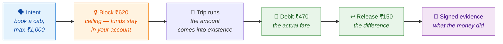
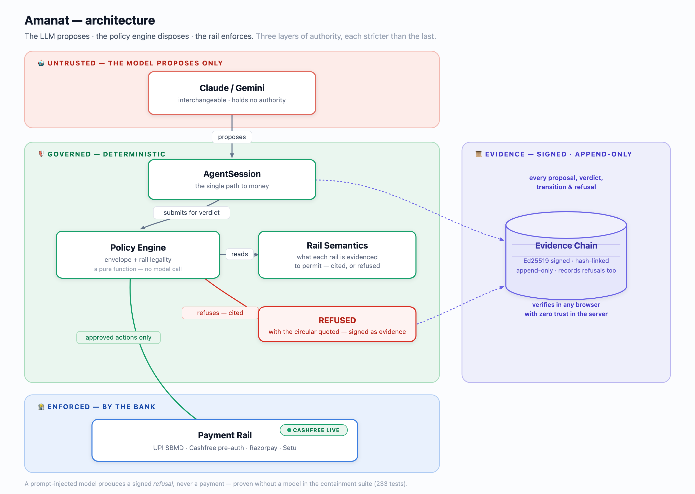
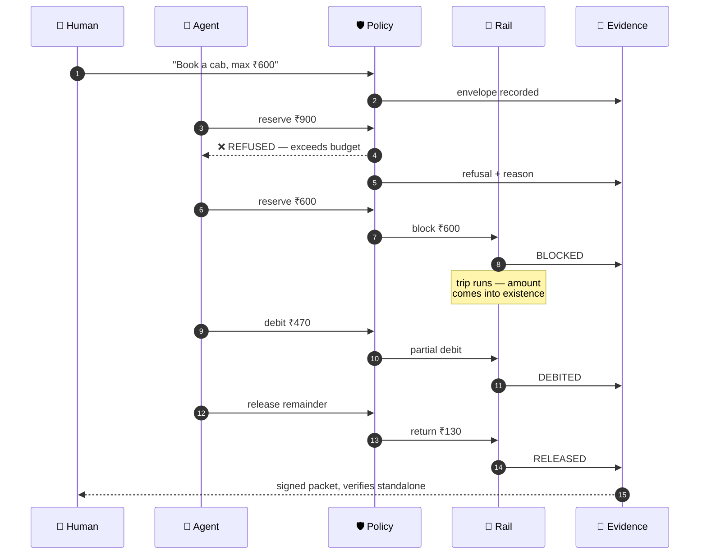

<div align="center">

# Amanat

**अमानत** — *a thing held in trust, to be returned to its owner*

### Amount-contingent settlement for agent-initiated payments

*Block a ceiling. Debit the actual. Prove what the money did.*

[](#testing)
[](#quick-start)
[](#what-it-does)
[](#the-evidence-table)
[](#testing)

### ▶ Try it live

**[Interactive demo](https://amanat-demo-699979063196.asia-south1.run.app)** — set a budget, run a settlement or attack it, watch the policy engine refuse and the signed chain verify itself — then load the signed receipt from a **real Cashfree pre-auth run** and verify *that* in your browser too.
&nbsp;·&nbsp;
**[Verify a signed packet](https://claude.ai/code/artifact/6edf0c30-6be8-4f60-961b-285b11af9995)** — recomputes its own hashes and signatures in your browser; press *Tamper* to watch it catch a change.
&nbsp;·&nbsp;
**Watch the mechanism run on a real rail** — `python -m amanat.rails.probe_cashfree` holds ₹620, debits ₹470, and the ₹150 comes back, live on Cashfree's UPI pre-auth sandbox.
&nbsp;·&nbsp;
**[Pitch deck (PDF)](docs/pitch/amanat-deck.pdf)** — the five-minute argument (`docs/pitch/amanat-deck.pptx` for editing).

</div>

---

<table>
<tr><td width="140"><b>Track</b></td><td><b>01 — AI Growth &amp; Agentic Commerce</b></td></tr>
<tr><td><b>Builder</b></td><td>Eeshan Singh Pokharia</td></tr>
<tr><td><b>Email</b></td><td><a href="mailto:eeshan.singh53@gmail.com">eeshan.singh53@gmail.com</a></td></tr>
<tr><td><b>Event</b></td><td>Razorpay AI Buildathon 2026</td></tr>
</table>

> **Track 01's bar:** *every money action explainable, bounded and gated; show the audit
> trail and one failure handled gracefully.*
>
> This is a governance and auditability project. It is deliberately modest in scope, and
> the section it is proudest of is [What building it found](#what-building-it-found) —
> which is entirely negative results.

---

## The problem

A human in a cab **watches the meter and pays what it says.** They never commit to a
number in advance.

An AI agent cannot do that. To spend on your behalf it has to commit to an amount
**before that amount exists** — before the meter has run, before the grocery
substitutions are known, before the charger reports kWh.

So it must choose a ceiling, and both directions of error cost real money:

<div align="center">

| Ceiling too **low** | Ceiling too **high** |
|:---:|:---:|
| debit declined → **sale lost** | customer's money **locked up for nothing** |

</div>

Everything here exists to make that choice safely, and to prove afterwards what actually
happened.

---

## What it does

Instead of prepaying or paying afterwards, the agent blocks a ceiling in **your own bank
account**, draws only the real amount, and returns the difference.



This runs on **UPI Single Block Multiple Debit** (NPCI's SBMD, branded *Reserve Pay*):
the ₹620 never leaves your account — blocked there, visible in your own UPI app,
revocable by you at any moment. That the rail *legally* permits a debit smaller than the
block is settled from the NPCI circular itself (OC-228, `PRIMARY` evidence), not from a
vendor's blog.

**And it is not only legal on paper — it runs.** The full *block → debit → release*
lifecycle was measured end to end on a live rail: Cashfree's UPI pre-authorization sandbox
held ₹620, captured ₹470, and returned the ₹150 **on its own** — `HTTP 200`,
`captured_amount 470.0`, `PRE_AUTH|Transaction Success`. Every other real rail measured here
*refused* the mechanism; this one accepts it. Reproduce in ~15 seconds:
`python -m amanat.rails.probe_cashfree`.

### The same intent across three real rails — measured, not quoted

The differentiator is not a claim, it is a set of live API responses. The same
amount-contingent settlement, asked of three real rails:

| Rail | Debit smaller than the block? | Evidence |
|---|---|---|
| **UPI SBMD** (Reserve Pay) | ✅ legal by the circular | `PRIMARY` — NPCI OC-228, read from the scanned PDF |
| **Cashfree** UPI pre-auth | ✅ **executed live** — ₹470 of ₹620, remainder auto-returned | `OBSERVED` — `HTTP 200`, measured 29 Aug 2026 |
| **Razorpay** manual capture | ❌ refused | `OBSERVED` — `HTTP 400`, *"Capture amount must be equal to the amount authorized"* |

The negative and the positive are both the point: Razorpay forecloses the mechanism,
Cashfree accepts it, and on the rail that keeps the remainder blocked (SBMD) versus the
one that returns it automatically (Cashfree pre-auth), the signed chain records which path
actually ran. Compare two chains side by side: `python -m amanat.compare`.

---

## Quick start

No credentials needed for the core. That is a design property, not an oversight.

```bash
git clone https://github.com/HERPESME/amanat && cd amanat

# The eight-act walkthrough — the whole argument in one command
uv run --with cryptography python -m amanat.demo

# 241 tests. No API key, no network.
uv run --with pytest --with cryptography --with httpx --with fastapi --with pydantic \
       --with numpy --with scikit-learn --with pandas --with pyarrow --with hypothesis pytest tests/ -q
```

```bash
# Same intent, two rails, two signed chains — side by side
uv run --with cryptography python -m amanat.compare

# A dispute packet that verifies itself in your browser (open the file it writes)
uv run --with cryptography python -m amanat.evidence.render

# Settle against a real AP2 mandate, then dispute it three ways
uv run --with cryptography python -m amanat.dispute.demo
```

> **Hosted:** the same demo runs at
> **<https://amanat-demo-699979063196.asia-south1.run.app>** (Cloud Run, scales to zero).

<details>
<summary><b>Optional — live agent, the ML frontier, real-rail settlement</b></summary>

```bash
cp .env.example .env        # add GEMINI_API_KEY or ANTHROPIC_API_KEY

# Which credentials are present, and does each actually work?
uv run --with google-genai --with httpx --with cryptography python -m amanat.doctor

# The LLM agent against a governed session
uv run --with google-genai --with cryptography python -m amanat.orchestrator.cli

# Ceiling frontier on real NYC TLC fares (downloads ~100MB once)
uv run --with numpy --with pandas --with scikit-learn --with pyarrow \
       python -m amanat.ceiling.frontier

# Watch the core mechanism run on a real rail: hold ₹620, debit ₹470, ₹150 returns
uv run --with httpx --with cryptography python -m amanat.rails.probe_cashfree

# Measure Razorpay's refusal of the same shape (HTTP 400), live
uv run --with httpx --with cryptography python -m amanat.rails.probe

# Settle a real Razorpay test-mode payment (capture then refund, real ids)
uv run --with httpx --with cryptography python -m amanat.rails.authorize
uv run --with httpx --with cryptography python -m amanat.rails.settle \
       --payment pay_XXXX --actual 47000
```

Docker:

```bash
docker compose run --rm demo      # walkthrough
docker compose run --rm tests     # containment suite
docker compose run --rm frontier  # ceiling frontier
```

</details>

---

## Architecture

The one sentence that carries the design:

<div align="center">

### The LLM proposes. The policy engine disposes. The rail enforces.

*Three layers of authority, each stricter than the last — and the outermost one is a bank.*

</div>

<div align="center">
  
</div>

If the model is prompt-injected, compromised, or simply wrong, the worst it can produce
is a **refusal record** — never a payment. That property is proven without a model in
`tests/test_session.py::test_a_refused_proposal_never_reaches_the_rail`, and stress-tested
by 23 adversarial tests.

📐 Full C4 diagrams: [`docs/architecture/`](docs/architecture/) ·
📋 Generated rail semantics: [`docs/RAIL_SEMANTICS.md`](docs/RAIL_SEMANTICS.md)

---

## One transaction, end to end



Step 3 is the interesting one. The model asked for a statistically sensible ceiling and
the policy engine said no, because **your budget is a harder boundary than the model's
confidence** — and the refusal is signed into the chain, so the artifact later shows not
only what happened but what was prevented.

---

## The two ideas worth explaining

### 1 · Every capability is cited, or it is refused

The code cannot say *"this rail supports X"* without a verbatim quote from the source.
There is no third state.

```python
Capability(
    name="partial_debit", supported=True,
    source_tier=SourceTier.PRIMARY,
    citation="NPCI/UPI/OC-228/2025-26",
    quote="The current block limits (unutilised) are always checked "
          "before initiating a debit...",
)
```

**Absence of evidence is not permission.** An `UNVERIFIED` capability returns `False`
from `permits()` even when `supported=True`. This is why the system spent a day
**refusing its own core mechanism** — partial debit was described only in vendor docs
until the NPCI circular was actually read.

| Tier | Meaning | Usable as fact? |
|---|---|---|
| `PRIMARY` | NPCI circular, RBI directive | ✅ |
| `OBSERVED` | measured against the live API — the quote *is* its response | ✅ |
| `SECONDARY` | PSP docs, for that PSP's own behaviour | ✅ |
| `MARKETING` | blog posts, comparison tables | ❌ |
| `UNVERIFIED` | believed, not confirmed | ❌ |

### 2 · The evidence chain goes below authorization

Every agent-payment evidence standard shipping today — **AP2's mandate chain, Visa
Trusted Agent Protocol, Mastercard Agentic Tokens, Pine Labs Grantex**, and the
offline-verifiable receipt lineage of US 12,671,588 — terminates at authorization: they
prove the agent was *permitted* to spend.

This extends the signed chain downward through the rail's own state transitions — block
placed, partial debit, release, revoke — **including the transitions the system refused
to make** — producing an artifact **verifiable by a party who does not trust the
orchestrator**.

That is an auditability contribution, not a payments one. It is modest, and saying so is
what makes it credible.

The artifact is real, not rhetorical: `python -m amanat.evidence.render` exports the chain
as a **self-contained HTML file that verifies itself in the browser** — recomputing every
hash with WebCrypto and re-checking every Ed25519 signature against the embedded key, with
no network and no trust in whoever produced it. Edit any payload and it names the entry
that no longer verifies.

> **▶ Verify one live in your browser:**
> **[claude.ai/code/artifact/6edf0c30…](https://claude.ai/code/artifact/6edf0c30-6be8-4f60-961b-285b11af9995)**
> — open it, then press **Tamper** and watch it catch the change.
> Source: [`docs/sample/dispute-packet.html`](docs/sample/dispute-packet.html).

### And the dispute the market has no answer for

Google AP2, OpenAI/Stripe ACP, Coinbase x402, Visa Trusted Agent Protocol and
Mastercard Agent Pay all establish that an agent was *permitted* to spend, and
stop there. The contested question comes after — a cardholder says *"my agent did
it"* — and there is no post-transaction record to settle it against. This project
produces exactly that record, so it can adjudicate.

Give it a signed packet, a real **AP2 Open Payment Mandate** (parsed from AP2's
own schema, `vct: mandate.payment.open.1` — the envelope round-trips through it,
it doesn't just borrow the field names), and a cardholder's claim. It verifies
the record, then states with cited entry numbers what the evidence shows:

- *"The ₹470 charged was authorized and within every bound — the AP2 mandate at
  entry #0 grants ₹800/txn to citycabs; entry #8 debited ₹470 to citycabs."*
- *"The disputed ₹5,000 was never charged — that attempt was refused at entry #2."*
- *"The signed record cannot establish delivery"* — the honest limit, stated not hidden.

One line governs it, and it's the one to say out loud: **this is an evidence
finding, not an issuer decision.** Whether a dispute is *won* is issuer
discretion; what this establishes is what the record shows. It claims no
win-rate, because a win-rate is not the record's to claim. The output is a
one-click, signed representment packet — authorization + evidence + finding —
that replaces the manual evidence scramble. Run it: `python -m amanat.dispute.demo`,
or press *dispute it* on the [live console](https://amanat-demo-699979063196.asia-south1.run.app).

---

## What building it found

The most useful outputs of this project are its findings — mostly negative, and one
decisive positive one. Each is cited, reproducible, and encoded in the capability table.

<table>
<tr>
<td width="30"><b>1</b></td>
<td><b>NPCI forbids delivery-contingent debit for goods</b><br/>
<i>"the delivery of goods and service should only be after the confirmation of successful
debit"</i> — OC-228. Post-delivery debit is carved out only for variable-amount services.
This killed the original thesis outright and forced the pivot to amount-contingency.</td>
</tr>
<tr>
<td><b>2</b></td>
<td><b>The rail never returns the change by itself</b><br/>
OC-200 keeps funds blocked <i>"till the time mandate is expired, revoked or the mandate
amount is exhausted"</i>. The word "release" appears in neither circular. Only 1 of 6
surveyed PSPs (Setu) can return the remainder without destroying the authorization.</td>
</tr>
<tr>
<td><b>3</b></td>
<td><b>Conformal coverage misses under temporal drift — 18 of 20 configurations</b><br/>
The guarantee is distribution-free but <b>not shift-free</b>. Training on January to
deploy in February breaks exchangeability. Calibrating on recent rather than random rows
narrows the gap ~10× (−3.55pp → +0.91pp) without closing it. A random split would have
shown a clean pass, and would have been a lie about deployment.</td>
</tr>
<tr>
<td><b>4</b></td>
<td><b>Setu's own docs name API hosts that do not exist</b><br/>
Credentials are valid and the token endpoint returns 200 — but <code>uatapi.setu.co</code>
and <code>api.setu.co</code> are <b>NXDOMAIN on both Google and Cloudflare</b> public
resolvers. Invisible until you hold credentials and try.</td>
</tr>
<tr>
<td><b>5</b></td>
<td><b>Razorpay refuses partial capture — measured, not quoted</b><br/>
<code>HTTP 400 — Capture amount must be equal to the amount authorized</code>, from the
live API. Reaching that state needed a browser: payment links auto-capture, and S2S
creation is not enabled on a self-serve account.</td>
</tr>
<tr>
<td><b>6</b></td>
<td><b>Cashfree UPI pre-auth accepts the mechanism — the one positive result, measured live</b><br/>
The full lifecycle ran end to end on the sandbox: a ₹620 hold, a <code>CAPTURE</code> of
₹470 returning <code>HTTP 200</code> with <code>captured_amount 470.0</code>, and the ₹150
remainder <b>auto-released</b> (an explicit void afterward is refused — there is nothing
left to void). This is the exact shape Razorpay rejects, accepted by a real regulated UPI
rail, and it is what turns <code>cashfree_preauth.partial_debit</code> from
<code>UNVERIFIED</code> to <code>OBSERVED</code>. It needed a support ticket to enable
(not self-serve) — recorded honestly. Reproduce: <code>python -m amanat.rails.probe_cashfree</code>.</td>
</tr>
</table>

---

## The evidence table

28 capabilities across 5 rails. What each claim rests on:

| Rail | Capabilities | Evidence |
|---|---|---|
| **UPI SBMD** (Reserve Pay) | 16 | 12 `PRIMARY` · 3 `SECONDARY` · 1 `UNVERIFIED` |
| **Cashfree** UPI pre-auth | 4 | 4 `OBSERVED` — measured live 29 Aug 2026 |
| **Razorpay** manual capture | 3 | 1 `OBSERVED` · 2 `SECONDARY` |
| **Setu UMAP** | 3 | 2 `OBSERVED` · 1 `SECONDARY` |
| **UPI OTM** | 2 | 1 `SECONDARY` · 1 `UNVERIFIED` |

Two capabilities remain deliberately `UNVERIFIED` (`sbmd.block_amount_reducible_without_revoke`,
`upi_otm.post_delivery_debit_goods`) — believed, not confirmed, so the policy engine refuses
to plan around them. Both NPCI circulars are committed in [`docs/sources/`](docs/sources/);
they are image-only scans, every quote read from pages rendered at 220 dpi.

---

## Project structure

```
src/amanat/
├── rails/
│   ├── semantics.py    ← the capability table. Cited or refused.
│   ├── simulator.py    ← enforces the same table the policy engine reads
│   ├── razorpay.py     ← real adapter; refuses what the rail cannot honour
│   ├── cashfree.py     ← real adapter; the rail that ACCEPTS partial debit (live)
│   ├── settlement.py   ← capture-then-refund on Razorpay's real verbs
│   ├── probe.py        ← measures Razorpay live (its refusal, HTTP 400)
│   ├── probe_cashfree.py ← drives the pre-auth lifecycle live (HTTP 200, ₹470 of ₹620)
│   ├── cashfree_settle.py ← signs a real Cashfree run into a verifiable evidence packet
│   └── authorize.py    ← browser harness for an authorized-but-uncaptured payment
├── policy/
│   ├── envelope.py     ← the human's grant. Frozen; widening leaves a trace.
│   └── engine.py       ← deterministic. No model call, ever.
├── evidence/
│   ├── chain.py        ← Ed25519 + SHA-256, append-only, records refusals
│   └── render.py       ← exports a chain as a browser-verifiable HTML packet
├── interop/ap2.py      ← reads/writes real AP2 Open Payment Mandates
├── dispute/            ← adjudicate a chain against its AP2 authorization
├── ceiling/            ← conformalized quantile regression on real NYC TLC fares
├── orchestrator/       ← governed core + swappable Claude/Gemini backends
├── compare.py          ← same intent, two rails, two signed chains
├── demo.py             ← the seven-act walkthrough
└── doctor.py           ← which credentials work, and which do not
```

---

## Testing

```bash
uv run --with pytest --with cryptography --with httpx --with fastapi --with pydantic \
       --with numpy --with scikit-learn --with pandas --with pyarrow --with hypothesis pytest tests/ -q
```

**241 tests, no credential and no network.** If proving the agent is bounded ever
required a live model, the agent would not be bounded.

| Suite | What it pins |
|---|---|
| `test_semantics.py` | every capability cited; unverified never permitted |
| `test_policy.py` | envelope + rail limits enforced; the live-measured Cashfree partial debit permitted, an unverified one refused |
| `test_evidence.py` | append-only, hash-linked, tamper detected by entry |
| `test_session.py` | no path to money skips policy |
| `test_adversarial.py` | 23 attacks — amounts, homoglyph payees, sequence, malformed calls |
| `test_ceiling.py` | conformal guarantee holds on *exchangeable* data |
| `test_backends.py` | a second LLM provider added no second route to money |
| `test_ap2_interop.py` | real AP2 Open Payment Mandates round-trip through the envelope |
| `test_adjudicate.py` | disputes adjudicated to cited findings; tamper caught before any finding |
| `test_properties.py` | money invariants proven over thousands of random sequences |
| `test_settlement.py` | capture-then-refund gated; double-settlement refused |
| `test_compare.py` | the two rails share no transition verbs |
| `test_render.py` | the browser's hashing reproduces Python's, byte for byte |

CI additionally regenerates `RAIL_SEMANTICS.md` and **fails on any diff**, so the prose
cannot claim more than the runtime honours.

---

## Honest limitations

Stated here rather than waiting to be asked.

- **Razorpay's `authorized` state has already debited the customer.** It is not a hold.
  Partial capture is unsupported there — measured, not assumed.
- **The core mechanism now runs live — on Cashfree, not SBMD.** Real *SBMD* access needs
  merchant activation, so the SBMD path is still the simulator (which cites the circular
  for every semantic it models). But amount-contingent settlement itself is no longer
  simulator-only: the identical *block → partial-debit → release* lifecycle was measured
  end to end on Cashfree's UPI pre-auth sandbox (`HTTP 200`, ₹470 of ₹620). Cashfree
  pre-auth had to be enabled by a support ticket — not self-serve — which is recorded as
  its own `OBSERVED` capability rather than glossed over.
- **No public Indian COD-RTO or metered-fare dataset exists.** The ceiling model trains
  on NYC TLC fares. The method transfers; the coefficients do not.
- **Razorpay already ships** RTO Shield, risk-tiered COD fees, partial COD, and a live
  Reserve Pay agentic pilot (23 Feb 2026). Risk enters through a seam here rather than
  being re-implemented.
- **Equensworldline `WO2020094875A1` (2018)** describes freeze-settlement,
  settle-at-a-reduced-amount and refund-the-remainder, plus a *"tamper-proof history of
  the operations"*. Neither the settlement mechanism nor tamper-proof payment history is
  claimed as new here.
- **`sbmd.block_amount_reducible_without_revoke` is UNVERIFIED.** No circular or PSP doc
  states whether a modify may *lower* an amount, so it is refused.

---

## References

**Primary** — NPCI/UPI/OC-228/2025-26 · NPCI/UPI/OC.No.200/2024-25 (both in
[`docs/sources/`](docs/sources/)) · RBI e-Mandate Framework, 21 Apr 2026

**Method** — Romano, Patterson &amp; Candès, *Conformalized Quantile Regression*,
NeurIPS 2019, [arXiv:1905.03222](https://arxiv.org/abs/1905.03222) ·
[NYC TLC trip records](https://www.nyc.gov/site/tlc/about/tlc-trip-record-data.page)

**Prior art conceded** — Google AP2 · Visa Trusted Agent Protocol · Mastercard Agentic
Tokens · Pine Labs Grantex · Equensworldline `WO2020094875A1` · US 12,671,588

---

<div align="center">

**Eeshan Singh Pokharia** · [eeshan.singh53@gmail.com](mailto:eeshan.singh53@gmail.com)

*Razorpay AI Buildathon 2026 — Track 01*

<sub><code>.claude/</code> holds the decision record — three adversarial reviewers, five
rounds, ~5,000 lines — and is deliberately not committed.</sub>

</div>
