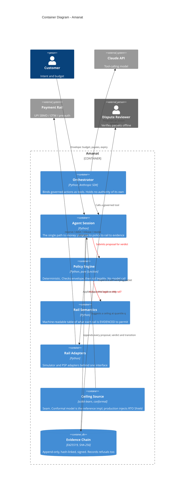

# Container Diagram — Amanat

The three-layer authority model, which is the whole architecture:

> **The LLM proposes. The policy engine disposes. The rail enforces.**

Each layer is stricter than the one above it, and the outermost is a bank. There
is no code path from the model to the rail that skips the middle.

The two red edges are the ones that carry the architecture. Everything else is
plumbing.

## Why the LLM is outside the trust boundary

The orchestrator has **no authority**. It can only call methods on `AgentSession`,
and every one of those routes through `PolicyEngine.evaluate` before reaching a
rail. A hallucinating, prompt-injected or simply wrong model produces a *refusal
record*, not a payment.

That property is testable without a model, and it is:
`tests/test_session.py::test_a_refused_proposal_never_reaches_the_rail`. If
proving the agent is bounded required running the agent, it would not be bounded.

## Why rail semantics is its own container

It is read by the policy engine *and* enforced by the simulator, so the two
cannot drift into disagreeing about what a rail permits. It also generates
`docs/RAIL_SEMANTICS.md`, so the prose cannot claim more than the runtime honours.

| Container | Needs network? | Needs an API key? |
|---|---|---|
| Orchestrator | yes | yes |
| Agent Session, Policy Engine, Rail Semantics, Evidence Chain | no | no |
| Ceiling Model | only to fetch TLC data once | no |
| Rail Adapters | simulator no; PSP adapters yes | PSP creds |
