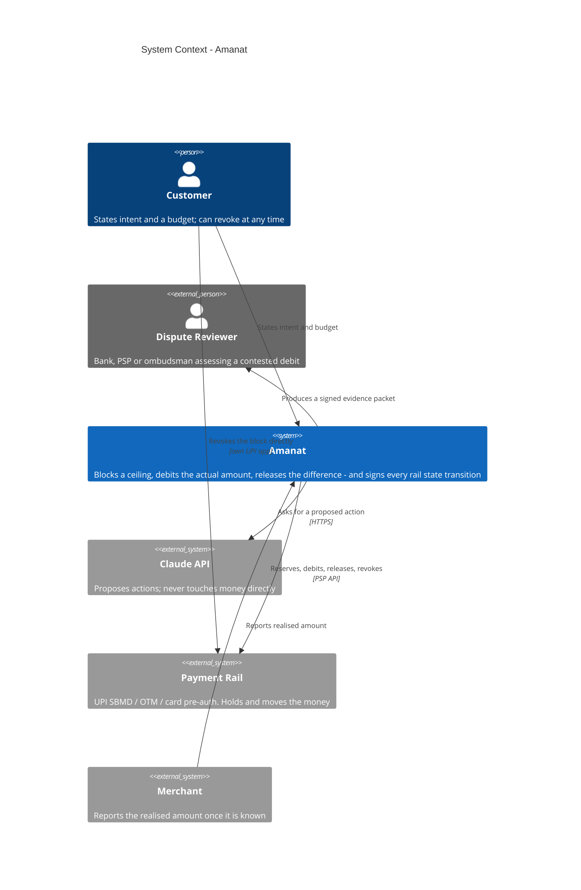

# System Context — Amanat

Who touches the system, and why it exists at all.

The framing problem: **an agent must commit to a spending ceiling before the final
amount exists.** A human in a cab never does this — they watch the meter and pay
what it says. An agent has to name a number up front, and both directions of
error cost someone money.

## What each relationship costs if it goes wrong

| Relationship | Failure | Who pays |
|---|---|---|
| Customer → Amanat | Budget too tight for the real fare | Sale is lost |
| Amanat → Rail (reserve) | Ceiling set too low | Debit rejected, sale lost |
| Amanat → Rail (reserve) | Ceiling set too high | Customer's money stranded |
| Customer → Rail (revoke) | Customer revokes mid-delivery | Merchant has shipped, cannot debit |
| Amanat → Dispute Reviewer | No evidence of what the money did | Merchant loses the representment |

The last row is the one nothing else on the market covers. Every shipping
agent-payment evidence standard terminates at **authorization** — it proves the
agent was *permitted* to spend. None of them records what the money subsequently
*did*.

## Deliberate non-goals

- **Not a fraud/RTO risk engine.** Razorpay ships RTO Shield and risk-tiered COD
  fees already. Risk enters through the `CeilingSource` seam (`ceiling/source.py`), never re-implemented.
- **Not a negotiation layer.** Measured surplus for instrument-negotiation is ~zero:
  merchants already publish unconditional prepaid incentives, and the merchant knows
  more about the buyer's risk than the buyer's agent does.
- **Not a new rail.** Amanat is strictly a consumer of rails it can evidence.
