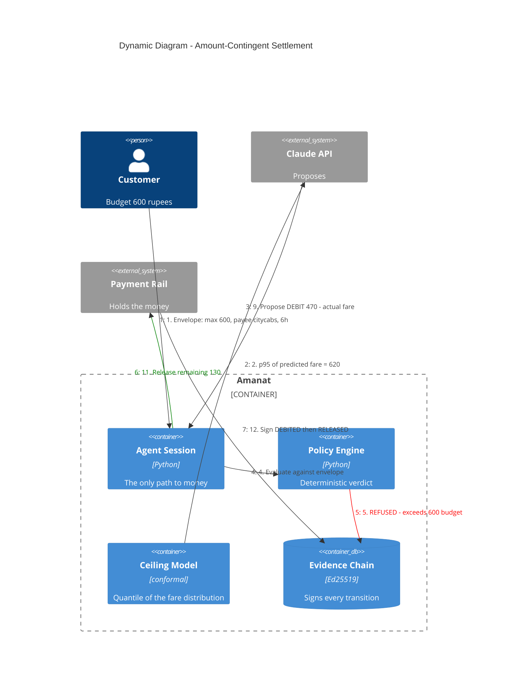

# Dynamic Diagram — Amount-Contingent Settlement

One cab ride, end to end, including the refusal. This is the flow the demo walks
through (`python -m amanat.demo`).

Step 5 is the interesting one. The model asked for the statistically correct
ceiling and the policy engine said no, because the human's budget is a harder
boundary than the model's confidence. The refusal is **signed into the evidence
chain**, so the dispute artifact later shows not only what happened but what was
prevented.

## The two failure modes, and why they are recorded differently

| Failure | Caught by | Why |
|---|---|---|
| Ceiling above the envelope budget | **Policy** | Locally knowable — refuse before spending a rail call |
| Debit above the standing block | **Policy** | Locally knowable — the engine tracks block state |
| Customer revokes mid-delivery | **Rail** | Not locally knowable. The customer acted out of band |
| Block expired / bank down | **Rail** | Not locally knowable |

A dispute needs to distinguish *"we refused"* from *"the bank refused"* — they
assign liability to different parties. Test:
`tests/test_session.py::test_the_two_failure_kinds_are_separable_in_the_audit_trail`.

## The graceful-failure demo (Act 4)

Under-set ceiling → debit rejected → **3 retries within 24h, the retry budget
NPCI OC-228 defines** → exhausted → block released → sale lost. Then the same
order at p95 succeeds, with the stranded amount shown.

One failure, a rail-defined retry budget, and a quantified tradeoff — rather than
a generic try/except.
